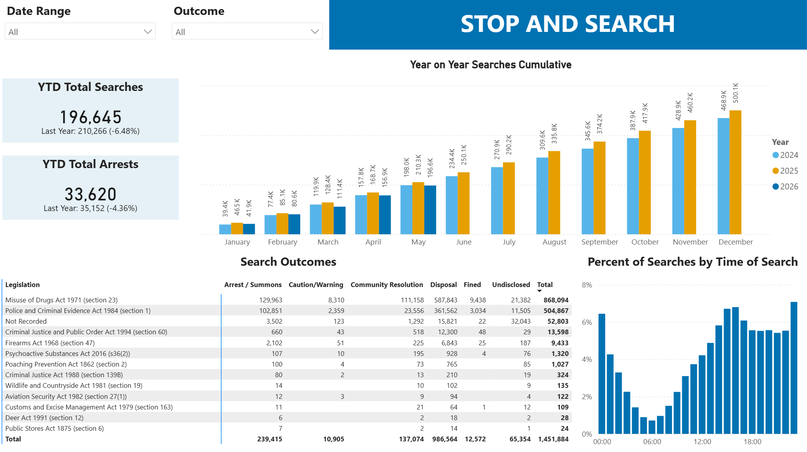
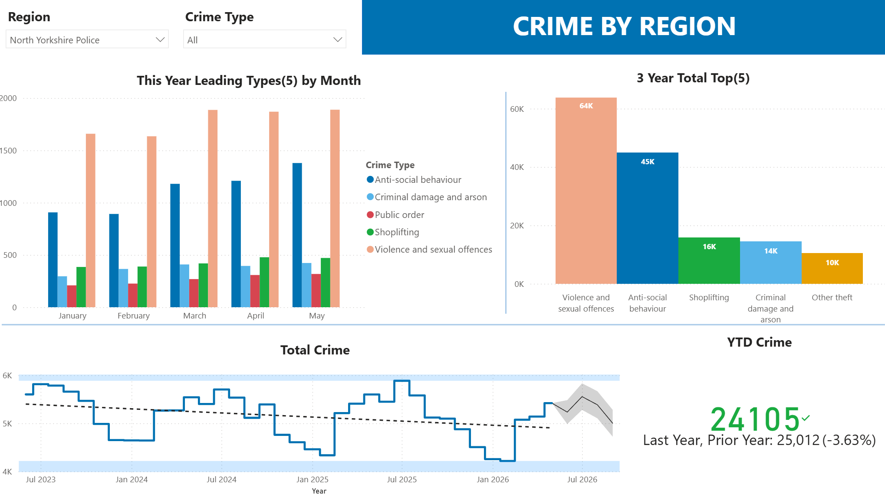

# UK Crime Data Pipeline

[github.com/JayWatNorm/UK-Crime-Pipeline](https://github.com/JayWatNorm/UK-Crime-Pipeline)

Python by hand using ai as a Python tutor and advisor around architecture, 
since this project i have passed my PCEP and I am currently working on dbt certification. 


A data engineering portfolio project: ingests, models, orchestrates, and visualizes
UK police street-level crime data at national scale.

Follow-up to [Comfort Compass](../Comfort-Compass), deliberately targeting the gaps
that project didn't cover:

- **Orchestration** — real DAG-based scheduling with retries and historical backfill (Airflow)
- **Scale** — a genuinely large, multi-year national dataset (~19M+ rows)
- **Visualization** — a polished but intentionally lightweight output layer

## Dashboards

Power BI reports built directly on the dbt marts, using a colour-blind-safe
palette throughout.

**Stop and search** — cumulative searches year on year, outcomes broken down by
the legislation the search was conducted under, and the distribution of searches
across the day.



**Crime by police force area** — leading crime types by month, the all-time
category breakdown, and total recorded crime over time with a trend line and
forecast band.



Figures describe **recorded** crime and searches. Recording practices vary
between forces and over time, so changes shown here do not necessarily reflect
changes in underlying offences. See `docs/data-source-notes.md` for coverage
limitations, including the absence of LSOA geography in Northern Ireland.

## Data source

[data.police.uk](https://data.police.uk/data/) — street-level crime archives
published by police forces across England, Wales, and Northern Ireland. Each
archive is a rolling ~3-year snapshot rather than a single month's data — see
`docs/data-source-notes.md` for the full schema, archive structure, and
backfill approach.

## Stack

| Layer | Choice | Status |
|---|---|---|
| Storage | PostgreSQL (Docker) | Built |
| Ingestion | Python | Built |
| Orchestration | Apache Airflow (Docker) | Built |
| Transformation | dbt | Built |
| Visualization | Power BI (dashboards) · Plotly + Jinja2 → static HTML | Dashboards built, static report in progress |
| Containerization | Docker Compose | Built |

Full architecture, phased task breakdown, and design rationale live in
`uk-crime-pipeline-project-plan.md` (project planning doc, kept outside this repo).


## Setup

```bash
cp .env.example .env   # fill in DB credentials
docker compose up -d   # brings up Postgres + Airflow
```

`.env` is the single source of truth for database connection details — both
`ingestion/ingest.py` and dbt read from it, so pointing it at a different
database is all that's needed to switch environments.

### Running dbt locally

dbt doesn't read `.env` files itself, so `run-dbt.ps1` loads it first and
passes through whatever arguments you give it:

```powershell
.\run-dbt.ps1 build
.\run-dbt.ps1 test
```

This is only needed for bare local runs. Inside Docker (and on the deployed
Airflow instance), connection details are set directly on the container, so
dbt is invoked normally there.

## Note

This project's Docker setup (Postgres container, image, volumes, `.env`) is
entirely separate from Comfort Compass's — no shared containers, networks,
or data between the two.
